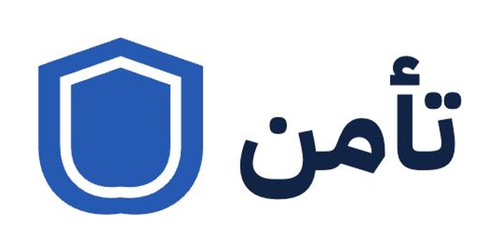

<p align="center">
  
</p>

<h1 align="center">Ta'man — تأمن</h1>

<p align="center">
  <b>منصة المفقودات والموجودات في الحرم الجامعي — جامعة الملك سعود.<br>
  تُصوِّر الغرض فيُكتب البلاغ عنك، وتُطابَق البلاغات بالمعنى لا بالكلمات، ويُسلَّم الغرض بتحقق من الطرفين.</b>
</p>

<p align="center">
  
  
  
  
  
  
</p>

<p align="center">
  <a href="https://tamanrksu.netlify.app"><b>جرّب المنصة →</b></a>
</p>

---

## المشكلة

المفقودات داخل الجامعة تُبلَّغ في قروبات واتساب متفرقة ومكاتب أمانات موزّعة على المباني. لا يوجد مكان واحد للبحث، والإبلاغ عن غرض وُجد مُكلف بما يكفي ليتجاهله الطالب، وبلاغات "مفقود" و"موجود" لا تُربط ببعضها.

والأخطر: من يقرأ وصف الغرض يستطيع أن يصفه ويدّعي ملكيته. **المشكلة ليست أن الغرض لا يعود، بل أن يعود إلى الشخص الخطأ.**

## كيف تعمل

1. **بلاغ** — تختار مفقود أو موجود، وتصوّر الغرض أو تكتب وصفه.
2. **مطابقة** — تُعرض عليك البلاغات المقابلة مرتّبة بدرجة التوافق.
3. **تحقق** — صاحب البلاغ يضع سؤالاً لا يعرف إجابته إلا المالك الحقيقي.
4. **تسليم** — رمز تسليم وتأكيد من الطرفين قبل إغلاق البلاغ.

## مزايا الذكاء الاصطناعي

| الميزة | ماذا تفعل |
|---|---|
| **صوّر وانشر** | ترفع صورة الغرض فيُستخرج منها التصنيف والعنوان والوصف تلقائياً. |
| **المطابقة الدلالية** | يُحسب تضمين (embedding) لكل بلاغ ويُخزَّن في `pgvector`، فيتطابق "سماعات بيضاء" مع "AirPods" رغم اختلاف الصياغة. الدرجة النهائية تجمع قواعد صريحة (الفئة والموقع والتاريخ) مع التشابه الدلالي. |
| **حارس الخصوصية** | يراجع الوصف قبل النشر فيرصد أرقام الجوال والهوية وأسماء الأشخاص، ويكتشف التفاصيل التي تسهّل انتحال الملكية ويقترح **نقلها إلى سؤال التحقق** بدل حذفها — فتتحول الثغرة إلى دليل ملكية. ويفحص الصور أيضاً ليمنع نشر وثائق الهوية. |
| **تقييم إجابة التحقق** | مؤشر استرشادي لصاحب البلاغ يقارن إجابة المطالِب بوصف الغرض. لا يَقبل ولا يرفض — القرار يبقى للإنسان. |

## الخصوصية والأمان

- لا تسجيل دخول: الهوية مرتبطة بمعرّف جهاز محلي، ولا تُجمع بيانات شخصية.
- بيانات التواصل لا تظهر للعامة، ولا تُكشف إلا بعد قبول طلب الاسترداد.
- التسليم يتطلب تأكيد الطرفين، فلا يُغلق البلاغ بضغطة واحدة من طرف واحد.
- مفتاح Gemini يبقى في الخادم (`netlify/functions/gemini.ts`) ولا يصل إلى المتصفح.

## التقنيات

React 19 · TypeScript · Tailwind CSS 4 · Vite · Supabase (Postgres + pgvector + Realtime + Storage) · `@google/genai` (Gemini) · Netlify Functions.

الواجهة عربية بالكامل (RTL)، مصمّمة للجوال أولاً، بثيم داكن.

## بنية المشروع

```
src/components/               شاشات وواجهات العرض
src/services/                 aiService · itemsService · profileService
src/utils/                    المطابقة والتحقق من المدخلات
src/config/                   الثوابت والنصوص العربية
netlify/functions/gemini.ts   وسيط الذكاء الاصطناعي في الخادم
supabase_rls_policies.sql     مخطط قاعدة البيانات وسياسات الوصول
```

## التشغيل محلياً

```bash
npm install
npm run dev
```

أنشئ ملف `.env.local`:

```
VITE_SUPABASE_URL=...
VITE_SUPABASE_ANON_KEY=...
GEMINI_API_KEY=...
```

ثم شغّل `supabase_rls_policies.sql` في محرر SQL داخل مشروع Supabase.

## النشر

المشروع مهيأ لـ Netlify: الواجهة ملفات ثابتة من `dist`، وطلبات الذكاء الاصطناعي تمر من دالة في الخادم. أضف `GEMINI_API_KEY` في متغيرات بيئة الموقع.

---

بُني في هاكاثون BUILDx.
